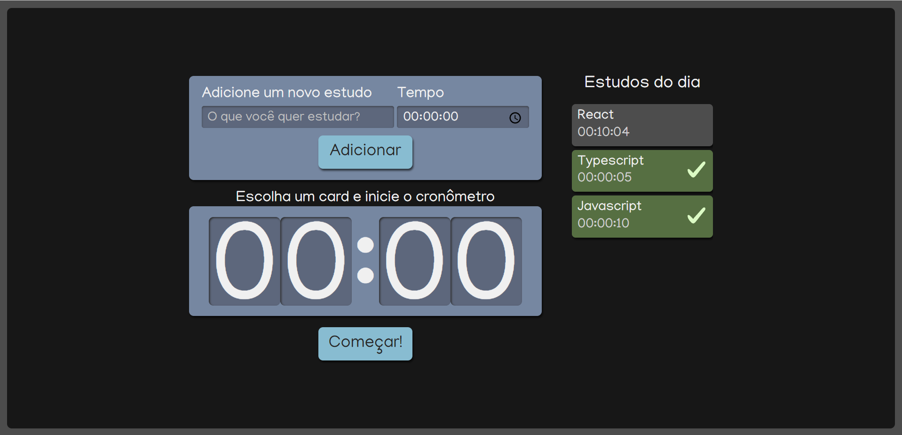

## Alura Studies

# Sobre o projeto

O Alura Studies gera uma lista de tópicos que você gostaria de estudar ao longo do dia, acompanhado do tempo que você separaria para cada tópico. Feito isso, é possível iniciar um crônometro em cada tarefa.

<h3>Funcionalidades:</h3>
<ul>
    <li>Adicionar tarefas e tempo para execução;</li>
    <li>Selecionar uma das tarefas a partir da lista criada;</li>
    <li>Iniciar crônometro;</li>
    <li>Marcação automática ao concluir a tarefa.</li>
</ul>

<h3>Tecnologias e recursos utilizados:</h3>
<ul>
    <li>React</li>
    <li>Typescript</li>
    <li>SCSS</li>
    <li>CSS</li>
    <li>CSS Module</li>
    <li>HTML</li>
</ul>

<h3>Rodando o projeto</h3>
# Clone esse repositório
$ git clone https://github.com/kimberlisabino/alura-studies.git

# Entre no diretório
$ cd alura-studies

# Instalar dependências
$ npm install

# Inicie o projeto
$ npm start
